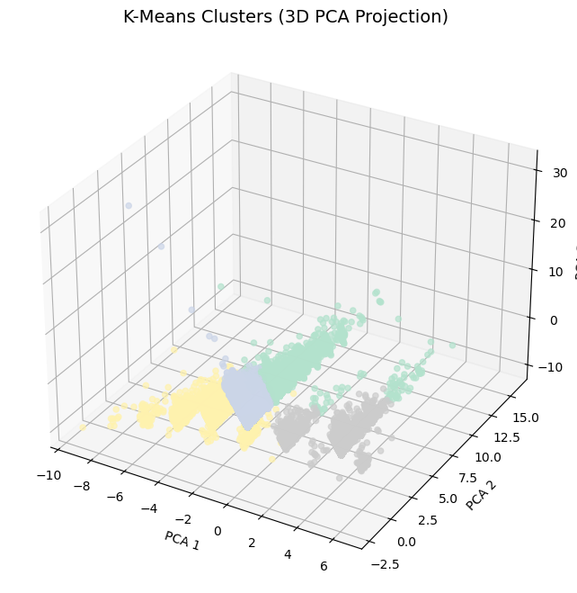

# Expedia User Segmentation (Clustering Project)

This project analyzes and groups Expedia users based on their travel behavior using **unsupervised machine learning**.  
The goal: identify distinct traveler personas with K-Means and Agglomerative Clustering, and translate insights into business strategies.

---

## 📂 Dataset

The dataset contains anonymized Expedia user interactions, including booking status, destination, search dates, and user-level attributes.  

🔗 **Dataset Link:** [Expedia Travel Dataset (Kaggle)](https://www.kaggle.com/datasets/jacopoferretti/expedia-travel-dataset)

---

## 🧠 Problem Statement

Travel platforms like Expedia serve users with vastly different booking habits.  
By clustering customers based on **trip duration, booking lead time, and travel distance**, we can uncover segments that improve:

- 🎯 Personalized recommendations  
- 📈 Marketing strategies  
- 💰 Pricing optimization  

---

## 🧰 What This Project Covers

- ✅ Data cleaning & handling missing values  
- ✅ Feature engineering (`travel_duration`, `days_in_advance`, `booking_ratio`, etc.)  
- ✅ K-Means clustering on full dataset  
- ✅ Agglomerative clustering on 40,000-user sample  
- ✅ Dimensionality reduction (PCA) for 2D/3D cluster visualization  
- ✅ Evaluation with **Silhouette Score** & **Davies-Bouldin Index**  
- ✅ Business interpretation of clusters  

---

## 📊 Results & Insights

The analysis revealed **four clear traveler segments**:

- **Early Planners** → book well in advance, shorter trips, nearby destinations  
- **Balanced Family Travelers** → moderate planning, mid/long distances  
- **Long-Haul Explorers** → longest trips, farthest destinations  
- **Last-Minute Travelers** → short, nearby trips booked close to departure  

**Evaluation Metrics:**  
- **K-Means (full dataset):** Silhouette = **0.4401**, Davies-Bouldin = **1.0662**  
- **Agglomerative (40K sample):** Silhouette = **0.4303**, Davies-Bouldin = **1.0987**  

👉 K-Means performed slightly better, producing more stable clusters.

---

## 📈 Visualizations

### PCA (2D Representation)


### PCA (3D Representation)


### Segmented Customers (Types of Personas)


---


## 🛠️ Tools & Libraries

- **Python**: Pandas, NumPy, Scikit-learn  
- **Visualization**: Matplotlib, Seaborn  
- **Dimensionality Reduction**: PCA  
- **Clustering**: K-Means, Agglomerative Clustering  
- **Evaluation**: Silhouette Score, Davies-Bouldin Index  

---

## 🚀 How to Run

1. Clone this repository:
   ```bash
   git clone https://github.com/Akshat-00/expedia_clustering_analysis.git
   cd expedia_clustering_analysis
2. Install dependencies
   ```bash
   pip install -r requirements.txt
3. Launch Jupyter Notebook
   ```bash
   jupyter notebook Expedia_cluster_analysis.ipynb
   
   

